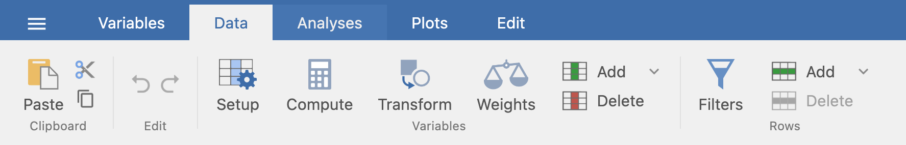

.. sectionauthor:: Laiton Hedley

========
Overview
========

When you bring your data into jamovi, it is not always ready for analysis. You
may need to recode responses, reverse score items, exclude outliers, or
compute new scores across multiple columns.

jamovi provides three primary tools for working with data: **Computed Variables**,
**Transformed Variables**, and **Filters**. You can find these tools in the
**Data** tab along the top of the jamovi window:

|data_ribbon|

Checking Your Data
------------------

All data in jamovi starts as :doc:`Data Variables <data_1_overview_data_variables>`
— the raw columns you bring in or enter directly. Before you start transforming,
check that each variable has the correct **Measure type** and **Data type**, and
that missing values are handled correctly.

The Three Tools
---------------

:doc:`Computed Variables <data_2_computed_variables>`
   Create new columns derived from existing ones using a formula — for example,
   summing item scores or computing a z-score. These are best suited for one-off
   calculations.

:doc:`Transformed Variables <data_3_transformed_variables>`
   Apply reusable transformations to one or more source columns — for
   example, reverse scoring a set of Likert items. You can apply the same
   transform to many columns at once.

:doc:`Filters <data_6_filtering_data>`
   Restrict which rows are included in your analyses without deleting any data.
   For example, you can exclude participants who failed an attention check.

Quick Reference
~~~~~~~~~~~~~~~

Not sure which one to reach for? Use this table:

.. list-table::
   :header-rows: 1
   :widths: 60 30

   * - If you want to…
     - Use
   * - Calculate a new value for each row (e.g., sum score, z-score)
     - Computed Variable
   * - Apply the same rule across many columns (e.g., reverse scoring 10 items)
     - Transformed Variable
   * - Recode values into categories (e.g., age groups, grade labels)
     - Transformed Variable
   * - Include only certain rows in your analyses
     - Filter
   * - Exclude outliers without deleting them
     - Filter

Reference and How-To
--------------------

* :doc:`Row and V Functions <data_4_row_v_functions>`: How row-wise and column-wise functions differ, and when to use each.
* :doc:`List of Functions <data_5_list_of_functions>`: All functions available in the formula editor.
* :doc:`Common Data Recipes <data_8_common_data_recipes>`: Step-by-step guides for reverse scoring, sum scores, outlier exclusion, and more.
* :doc:`Restructuring Data <data_7_restructure_data>`: Converting between wide and long format using the jReshape module.
* :doc:`Date Handling <data_9_date_handling>`: Working with date values using special date functions.

