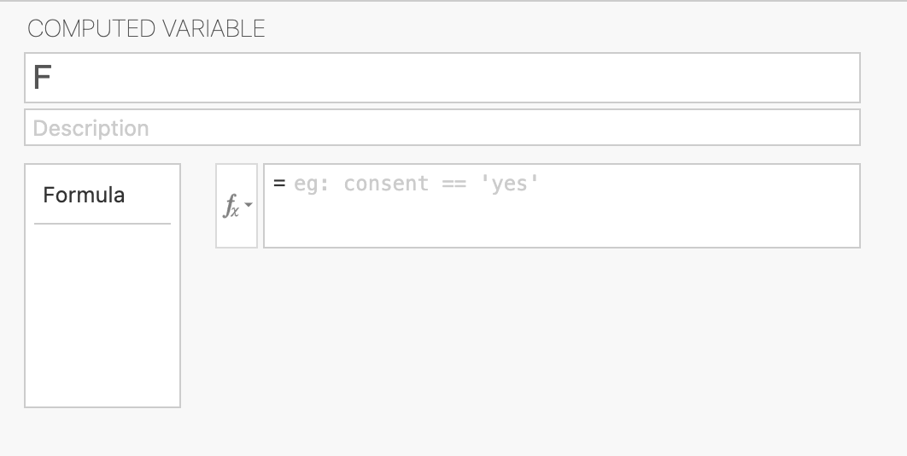

.. sectionauthor:: Laiton Hedley

========
Overview
========

    When analysing data, it is common for data to come in in a somewhat messy format. It's often necessary to "tidy" and transform our data so that it is in a form suitable for our analyses. This may involve computing sum scores for each partipant, excluding outliers, recoding responses, transforming response variables to different scales, aggregation (such as computing mean response time for each participant), etc.

    The following describes the various data manipulation and transformation facilities that jamovi provides.

==============
Data Variables
==============

    - Setting data type and measure type
    - Missing values
    - Adding labels to levels
    - Reordering levels
    - 'Retain unused levels in analyses'
    - Some existing content https://www.jamovi.org/user-manual.html#data-variables

.. _computed-variables:

==================
Computed Variables
==================

    Computed variables are used to transform values from the existing columns, creating new columns of data for analysis. For example, a computed column can transform responses to z-scores, or compute a total score from a number of survey items.

    Values are computed using simple formulas such as:

        Z(response)

        Q1 + Q2 + Q3 + Q4

    where ``response``, and ``Q1`` .. ``Q4`` refer to existing columns in the data set.

    The simplest way to add a new computed variable to a data set is to select the ``Add`` (variable) button from the ``Data`` tab. Selecting ``Append`` under ``Computed variables`` will add a new computed column to the very right of the data set. To configure the computed variable, select either ``Setup`` from the ``Data`` tab, or double click on the column header. This will the variable editor which looks as follows (for computed variables):

    |computed_screenshot|

    Here the new column can be named and given a description. Selecting the small fx button will bring down a list of the functions available and the list of variables (these can be inserted by double-clicking them). It's also possible to construct a formula by simply typing directly into the formula box.

    A number of functions are available. See :ref:`list-of-functions` for details.

    Computed variables are ideal for one-off computations, but where the same computation needs to be applied many times across many columns (For example, reverse scoring a number of responses), creating a computed variable for each column becomes tedious. In contrast, ``Transformed variables`` allow for the same transform to be applied across any number of columns. Further, transformed variables are ideal for "if-then" recoding of variables.

=====================
Transformed Variables
=====================

    ``Transformed variables`` are better suited for more complex transformations (such as reverse scoring and recoding variables) and allow the same transform to be applied across multiple columns of data.
    To add a new transformed variable to a data set, select the ``Add`` (variable) button from the ``Data`` tab.  Under ``Transformed Variable`` select ``Append``, this will add a new Transformed column to the very right of the data set. To configure the Transformed variable, select either ``Setup`` from the ``Data`` tab, or double click on the column header. By doing so, the following variable editor will appear:

    |Transformed_Variable|

    Here the new column can be given a name and a description - this can be helpful if you wish to use the same transformation multiple times. To perform the transformation, select the ``Source variable``, that is the column of data to transform.
    Additionally, select ``using transform``, which allows for either the selection of an existing transformation or the ability to create a new one by selecting ``Create New Transform...``.
    When creating a new transformation, a formula editor (like the computed variables option) will appear.
    The formula editor (via this option) requires the use of the ``$source`` variable to refer to the source variable selected earlier.

    For example, there is a survey item that needs to be reversed score. By using the ``New Transformed Variable`` option, the item can be reverse scored with the following formula:

      ``7 - $source``

    In this example, ``$source`` would be item_3 and we are assuming a 6-point Likert scale (hence the 7 minus):

    Applying this will yield results where 6 becomes 1, 5 becomes 2, 4 becomes 3, and so on:

    .. list-table:: Example of Reverse Scoring
       :header-rows: 1

       * - Item_1
         - Item_2
         - Item_3
         - 7 - $source
       * - 4
         - 3
         - 3
         - 4
       * - 3
         - 4
         - 6
         - 1
       * - 4
         - 4
         - 2
         - 5

    Once created, this transformation can be applied across any number of such variables (such as items_1, items_2, and so on) -- we will explore this shortly.

Recoding Variables
------------------

    *Transformed variables* are also ideal for recoding variables, i.e., recoding ``1-4`` and ``5-10`` cigarettes per day to ``Smoker`` and ``0`` cigarettes per day to ``Non-smoker``, or recoding values greater than or equal to 85 as a ``High Distinction``, greater than 75 as a ``Distinction``, etc.
    Recoding is performed by adding recode conditions with the ``Add recode condition`` button. Each recode condition is made up of a condition, i.e. ``$source == '1-4'``, or ``$source >= 85``, and a value to use if that condition is true, i.e. ``'Smoker'``, ``'High Distinction'``

    See the following example where grades are being assigned based on exam scores.:

    |Recode_Variable|

    Adding the additional conditions for the C and P grades would result in a transformed variable that would perform the following recoding.

    .. list-table:: Example of Recoding
       :header-rows: 1

       * - Exam Score
         - Grade
       * - 50
         - P
       * - 90
         - HD
       * - 44
         - F
       * - 76
         - D
       * - 66
         - C

    Note that when evaluating recode conditions, jamovi evaluates each condition one after another, and uses the value from the first condition that resolves to be true. In the above example, this allowed us to express the ``Distinction`` condition as ``$source >= 75``, rather than the longer ``$source < 85 and $source >= 75``. Values greater or equal to 85 will already been taken care of by the first condition.

Transforming Multiple Variables
-------------------------------

There are situations where multiple varibles need to be transformed. For example, there may be a number of items in a survey data set which need to be reverse scored.
Instead of recoding each item, one at a time, jamovi conveniently allows for the same transformation to be applied in a single step.

In this approach, select the variables to transform (either by holding down ctrl or ⌘ and clicking the colum headers, or selecting multiple variables under the ``Variables`` tab), and then select ``Transform`` from the ``Data`` tab. For each variable selected, a matching transformed variable will created, with the ``Source variable`` set accordingly. This allows you to define a single transform, and apply it across multiple variables at once.

.. * do we need an image for this? *

===================
Row and V Functions
===================

Functions in jamovi can be either *Row functions* or *Variable functions*.

Row Functions
-------------

*Row functions* only make use of other values in the same row. For example, the function ``MEAN(A, B, C)`` will result in a column of values where each cell's value is only computed from the values in its row.

.. list-table:: Example of the MEAN() Function
   :header-rows: 1

   * - A
     - B
     - C
     - MEAN(A, B, C)
   * - 1
     - 3
     - 4
     - 2.33
   * - 6
     - 3
     - 1
     - 3.33
   * - 5
     - 5
     - 9
     - 6.33

V Functions
-----------

*V functions* or *Variable functions* (typically prefixed with the letter ``V``), compute values using the entire variable. For example, ``VMEAN(A)`` computes the mean of the *entire* variable ``A``.

.. list-table:: Example of the VMEAN() Function
   :header-rows: 1

   * - A
     - B
     - C
     - VMEAN(A)
   * - 1
     - 3
     - 4
     - 4
   * - 6
     - 3
     - 1
     - 4
   * - 5
     - 5
     - 9
     - 4

It's possible to combine Row and V functions together. For example, to compute a z-score, use the function

  ``(A - VMEAN(A)) / VSTDEV(A)``

(but it's also possible to use the more concise ``Z(...)`` function!)

Grouping with V Functions
-------------------------

Several V functions allow a ``group_by`` parameter, allowing the calculation of values within groups.

Perhaps you have a dataset with a column labelled Dosage to indicate the treatment each participant recieved (e.g., 50 mg vs 100 mg vs 150 mg).
To compute the mean score of the outcome variable for each Dosage group separately (without the scores from one treatment being combined with those from another) call the ``group_by`` parameter, such as:

  ``VMEAN(outcome, group_by = Dosage)``

.. list-table:: Example of the VMEAN() Function with group_by argument
   :header-rows: 1

   * - Dosage
     - outcome
     - VMEAN(outcome, group_by = Dosage)
   * - 150 mg
     - 4
     - 4.33
   * - 150 mg
     - 4
     - 4.33
   * - 150 mg
     - 5
     - 4.33
   * - 100 mg
     - 3
     - 3
   * - 100 mg
     - 2
     - 3
   * - 100 mg
     - 4
     - 3
   * - 50 mg
     - 1
     - 1.33
   * - 50 mg
     - 2
     - 1.33
   * - 50 mg
     - 1
     - 1.33

.. _list-of-functions:

====================
⚡ List of Functions
====================

.. https://github.com/jamovi/jamovi/blob/4b490813d1442f93059e606a15ac39ef626c6d07/client/main/vareditor/formulatoolbar.ts#L89-L168

.. list-table:: Functions available in jamovi
   :header-rows: 1
   :widths: 12 55 10

   * - Function
     - Description
     -
   * -
     - **MATH FUNCTIONS**
     -
   * - ``ABS(var)``
     - Absolute value: Returns the absolute value in a column of data.
     - `More info <https://en.wikipedia.org/wiki/Absolute_value>`__
   * - ``EXP(var)``
     - Exponential: raises *e* to the power of each value in a column of data.
     - `More info <https://en.wikipedia.org/wiki/Exponential_function>`__
   * - ``LN(var)``
     - Natural logarithm (base *e*): the natural logarithm (base e) of each value in a column of data.
     - `More info <https://doi.org/10.1177/00045632211050531>`__
   * - ``LOG10(var)``
     - Log base 10: the logarithm (base 10) of each value in a column of data.
     - `More info <https://doi.org/10.1177/00045632211050531>`__
   * - ``SQRT(var)``
     - Square root: the square root of each value in a column of data.
     - `More info <https://en.wikipedia.org/wiki/Square_root>`__
   * -
     - **STATISTICAL FUNCTIONS**
     -
   * - ``ABSIQR(var)``
     - Absolute deviation from the median: measures the average absolute deviation of values from the median. Convenience short-hand for ``ABS(IQR(var))``.
     - `More info <https://en.wikipedia.org/wiki/Interquartile_range>`__
   * - ``ABSZ(var)``
     - Absolute z-score: Convenience short-hand for ``ABS(Z(var))``
     -  `More info <https://en.wikipedia.org/wiki/Standard_score>`__
   * - ``BOXCOX(var)``
     - Box Cox: Returns a Box Cox transformation of the variable.
     - `More info <https://en.wikipedia.org/wiki/Power_transform#Box%E2%80%93Cox_transformation>`__
   * - ``CEILING(var)``
     - Ceiling: returns the smallest integer that is greater than or equal to each value in a column of numbers, effectively rounding up to the nearest whole number.
     - `More info <https://en.wikipedia.org/wiki/Floor_and_ceiling_functions>`__
   * - ``FLOOR(var)``
     - Floor: returns the greatest integer that is less than each value in a column of numbers, effectively rounding down to the nearest whole number.
     - `More info <https://en.wikipedia.org/wiki/Floor_and_ceiling_functions>`__
   * - ``IQR(var)``
     - Interquartile Range: Returns values of 0 to indicate a number is within the box of a boxplot and values larger than 1.5 to indicate the number is outside the whiskers.
     - `More info <https://en.wikipedia.org/wiki/Interquartile_range>`__
   * - | ``MAX(var)``
       | ``VMAX(var)``
     - Maximum: identifies the highest value in a row or column of data.
     - `More info <https://en.wikipedia.org/wiki/Maximum_and_minimum>`__
   * - ``MAXABSIQR(var)``
     - Maximum Absolute Interquartile Range: Convenience short-hand for ``MAX(ABSIQR( variable 1, variable 2, … ))``.
     - `More info <https://en.wikipedia.org/wiki/Interquartile_range>`__
   * - ``MAXABSZ(var)``
     - Maximum Absolute Z-Score: Convenience short-hand for ``MAX(ABSZ( variable 1, variable 2, … ))``.
     - `More info <https://en.wikipedia.org/wiki/Standard_score>`__
   * - | ``MEAN(var)``
       | ``VMEAN(var)``
     - Mean: Calculate the mean score across a row or column of data.
     - `More info <https://en.wikipedia.org/wiki/Mean>`__
   * - | ``MIN(var)``
       | ``VMIN(var)``
     - Minimum: identifies the lowest value in a row or column of data.
     - `More info <https://en.wikipedia.org/wiki/Maximum_and_minimum>`__
   * - ``RANK(var)``
     - Ranking: assigns an ordinal rank to each value in a column of data.
     - `More info <https://en.wikipedia.org/wiki/Ranking_(statistics)>`__
   * - ``ROUND(var, n)``
     - Rounding: adjusts each value in a column of data to a specified number of decimal places or to the nearest whole number.
     - `More info <https://en.wikipedia.org/wiki/Rounding>`__
   * - ``SCALE(var)``
     - Scale: Returns the normalized values of a set of numbers - synonym for ``Z(var)``.
     - `More info <https://en.wikipedia.org/wiki/Standard_score>`__
   * - | ``STDEV(var)``
       | ``VSTDEV(var)``
     - Standard deviation: measures the amount of standard deviation in a row or column of data.
     - `More info <https://en.wikipedia.org/wiki/Standard_deviation>`__
   * - | ``SUM(var)``
       | ``VSUM(var)``
     - Summation: Returns the sum of a row or column of data.
     - `More info <https://en.wikipedia.org/wiki/Summation>`__
   * - ``VMAD(var)``
     - Median Absolute Deviation: Returns the median absolute deviation of a variable.
     - `More info <https://en.wikipedia.org/wiki/Median_absolute_deviation>`__
   * - ``VMADR(var)``
     - Robust Median Absolute Deviation: Returns the robust median absolute deviation of a variable.
     - `More info <https://en.wikipedia.org/wiki/Median_absolute_deviation>`__
   * - ``VMED(var)``
     - Median: Returns the median of a variable.
     - `More info <https://en.wikipedia.org/wiki/Median>`__
   * - ``VMODE(var)``
     - Mode: Returns the most common value, or mode, in a variable.
     - `More info <https://en.wikipedia.org/wiki/Mode_(statistics)>`__
   * - ``VN(var)``
     - Sample Size (or n): Returns the number of cases in a variable.
     - `More info <https://en.wikipedia.org/wiki/Sample_size_determination>`__
   * - ``VSE(var)``
     - Standard Error: Returns the standard error of a variable.
     - `More info <https://en.wikipedia.org/wiki/Standard_error>`__
   * - | ``VAR(var)``
       | ``VVAR(var)``
     - Variance: Returns the variance of a row or column of data.
     - `More info <https://en.wikipedia.org/wiki/Variance>`__
   * - ``Z(var)``
     - Z-score: Returns the normalized values of a set of numbers.
     - `More info <https://en.wikipedia.org/wiki/Standard_score>`__
   * -
     - **LOGICAL FUNCTIONS**
     -
   * - ``IF(var, value, else)``
     - If the expression resolves true, use the value, otherwise the else.
     - `More info <https://en.wikipedia.org/wiki/Conditional_(computer_programming)>`__
   * - ``IFMISSING(var, value, else)``
     - When the variable contains a missing value, use the value, otherwise the else.
     - `More info <https://en.wikipedia.org/wiki/Conditional_(computer_programming)>`__
   * - ``NOT(var)``
     - Inverts a boolean value: true (1) becomes false (0), false (0) becomes true (1).
     - `More info <https://en.wikipedia.org/wiki/Negation>`__
   * -
     - **TEXT FUNCTIONS**
     -
   * - ``CONTAINS('needle', haystack)``
     -  Determines if specificied string of text (i.e. 'needle') appears in the variable (i.e. haystack) and can be expanded to look for multiple strings across one or more variables: ``CONTAINS('text_1', 'text_2', var_1, var_2)``.
     - `More info <https://en.wikipedia.org/wiki/String_searching_algorithm>`__
   * - ``SPLIT(var, 'by', position)``
     - Splits a string of text in a variable by a specified character (or string of text) and returns only the text at the specified position. For example, the string `ParticipantbyP01` using ``SPLIT(var, 'by', 3)`` would return `P01`.
     -  `More info <https://en.wikipedia.org/wiki/String_(computer_science)>`__
   * - ``TEXT(var)``
     - Converts values to text format (numbers to strings of text).
     -  `More info <https://en.wikipedia.org/wiki/String_(computer_science)>`__
   * - ``VALUE(var)``
     - Converts text (strings) to values (if possible).
     - `More info <https://en.wikipedia.org/wiki/String_(computer_science)>`__
   * -
     - **DATE/TIME FUNCTIONS**
     -
   * - ``DATEVALUE(var)``
     - Takes a date in text format (i.e. 2000-12-20) and converts to the number of days since the 1st of January, 1970.
     -
   * - ``DATE(var)``
     - Takes a number representing the number of days since the 1st of January 1970, and produces a formatted date.
     -
   * -
     - **REFERENCE FUNCTIONS**
     -
   * - ``HLOOKUP(index, value_1, value_2, ...)``
     - Why would anyone use this? WTF DOES THIS EVEN MEAN: The value in the provided values at index.
     -
   * - ``MATCH(value, value_1, value_2, ...)``
     - Why would anyone use this? WTF DOES THIS EVEN MEAN: The index of value in the provided values.
     -
   * -
     - **MISC. FUNCTIONS**
     -
   * - ``COUNT(var)``
     - Counts the number of non-missing values.
     - `More info <https://en.wikipedia.org/wiki/Counting>`__
   * - ``FILTER(var, filter expression)``
     - Filters a variable using a filter expression. For example, ``FILTER(var_1, var_2 == "Group_A")`` returns only rows in var_1 where var_2 is matched with the label "Group A".
     - `More info <https://blog.jamovi.org/2018/04/25/jamovi-filters.html>`__
   * - ``INT(var)``
     - Converts a number to an integer.
     - `More info <https://en.wikipedia.org/wiki/Integer>`__
   * - ``OFFSET(var, n)``
     - Offsets a column of data up or down by +/- n rows
     - `More info <https://en.wikipedia.org/wiki/Offset_(computer_science)>`__
   * - ``ROW()``
     - Returns a column with each row indicating the row number.
     - `More info <https://en.wikipedia.org/wiki/Row_and_column>`__
   * - ``SAMPLE(var, n)``
     - Draws a random sample of n values from a variable.
     - `More info <https://en.wikipedia.org/wiki/Sampling_(statistics)>`__
   * - ``VROWS(var)``
     - Returns the number of rows of a variable.
     - `More info <https://en.wikipedia.org/wiki/Row_and_column>`__
   * -
     - **SIMULATION FUNCTIONS**
     -
   * - ``BETA()``
     - Draws samples from a Beta distribution.
     - `More info <https://en.wikipedia.org/wiki/Beta_distribution>`__
   * - ``GAMMA()``
     - Draws samples from a Gamma distribution.
     - `More info <https://en.wikipedia.org/wiki/Gamma_distribution>`__
   * - ``NORM()``
     - Draws samples from a Normal (Gaussian) distribution.
     - `More info <https://en.wikipedia.org/wiki/Normal_distribution>`__
   * - ``UNIF()``
     - Draws samples from a Uniform distribution.
     - `More info <https://en.wikipedia.org/wiki/Uniform_distribution_(continuous)>`__

Understanding Formulas
----------------------
  In jamovi formulas are constructed using a combination of numbers, variables, values, operators and functions.

  Numbers are simply numbers (i.e. 1, 2.5, -3), adding two numbers together performs arithmetic (i.e. 2 + 2 = 4).
  Variables are referred to by their name (i.e. variable_name) and can be referred to with backticks as well (i.e. \`variable name\`) - when the variable name contains spaces it is a requirement to use backticks otherwise jamovi will not be able to interpret the formula correctly.

  Often we use strings of text in our rows of data to indicate categories or conditions.
  In jamovi, adding two text values together performs concatenation or rather joins them together (i.e. hello + world = helloworld)
  Adding numbers and strings of text together, again performs concatenation where by the number is converted to text alogside the string of text (i.e. 2 + apples = 2apples).

  When using formulas often we may wish to use ``and`` and ``or``  when performing are logical operations (i.e. ``IF(var_1 > 5 and var_2 < 10, 'Yes', 'No')`` and ``IF(var_1 == 'A' or var_2 == 'B', 'Match', 'No Match')``)

  values surrounded by ticks are strings of text (i.e. \'10\')

==============
Filtering Data
==============
  Often only a subset of data is needed for an analysis. For example, perhaps only participants who smoke are needed in an analysis.
  By clicking the data tab and selecting the filter icon, a filter is created and restricts any analyses to only those rows that meet the filter's criteria.

  |Filter_Data|

  The filer used above, ``Smoke == 'Yes'``, has filtered out any participants who do not smoke or rather restricted the data set to only participants who smoke.
  Below is an example of how this filter has effected the data, the first column shows the rows that are included (with a tick) and which are excluded (with a cross):

    .. list-table:: Example of Filtering Data
      :header-rows: 1

      * - Filter
        - Smoke
        - Outcome
      * - ✔
        - Yes
        - 10
      * - ✘
        - No
        - 4
      * - ✘
        - No
        - 6
      * - ✔
        - Yes
        - 9
      * - ✔
        - Yes
        - 9

  Only the data that has a tick (or rather participants who smoke) will be included in analyses and visualisations.
  It is possible to filter out based on multiple variables by using the ``and`` and ``or`` operators.
  For example, to filter based on Female Sex and Age greater than 30 the following filter could be used: ``Sex == 'Female' and Age > 30``.
  The same principles can be applied for ``or`` conditions as well and if wishing to filter on the same variable multiple times.

  Alternatively, an additional filter can be created by clicking the plus icon in the filter editor.
  A second filter will appear below the first, and by adding the desired filter criteria such as ``Age > 30``, the data will be filtered based on both filters.
  Additionally, we can toggle each filter on and off by clicking the toggle and switching it to active or inactive:

  |Toggle_Filter_Data|

  .. More information about filters can be found in our blog post `here <https://blog.jamovi.org/2018/04/25/jamovi-filters.html>`_.

.. I think VFUNCTIONS work the way I would expect them to with filters... but maybe we chat...
.. . and why you can't use *V functions* in filters (sad face) (we'll need to link to this explanation)

==================
Restructuring Data
==================

  When working with data, it is often necessary to restructure the data from a wide format to a long format or vice versa.

  A quick rule of thumb for recognising wide versus long format is this: in wide format, each row represents a participant, and repeated measurements are stored in separate columns (one column per outcome at each time point or condition).
  And in long-format, each row represents a single measurement occasion for a participant.
  Multiple rows exist per participant, with each row representing a different time point or condition.
  See our blog post here for more information on

  To restructure data in jamovi (at this time) requires the jReshape and jTransform modules.
  Each module can be found by clicking the plus icon in the top right of jamovi and searching for the module name.

  For example, say there is some data of participants Score on a cognitive task with three levels of difficulty: Easy, Medium, and Hard.
  Below is a table showing the wide format version of this data, but instead we'd rather look at this in long format (since the manipulation was a within-subjects design).

    .. list-table:: Wide Format Example
      :header-rows: 1

      * - ID
        - Score_Hard
        - Score_Medium
        - Score_Easy
      * - 1
        - 30
        - 50
        - 70
      * - 2
        - 20
        - 30
        - 55
      * - 3
        - 40
        - 50
        - 52

  To transform this so each row represents a single measurement occasion for a participant or rather in long format, the three score columns must become a single column, and new column is needed to indicate the condition (i.e., Hard, Medium, Easy).

  The jtransform module makes this easy. After installing and loading the jtransform module, select the ``Analyses`` tab, click on ``Data`` and then from the dropdown select ``Wide to Long``.
  By moving the three score columns (``Score_Hard``, ``Score_Medium``, ``Score_Easy``) into the ``Variables to be Transformed`` box and ``ID`` into ``the Variable That Identifies the same Unit`` box and click the blue ``Create`` button a new data set will be created in long format.
  The new data set should have succesfully restructured the data from wide format to long format as shown below:

    .. list-table:: Long Format Example
      :header-rows: 1

      * - ID
        - Condition
        - Score
      * - 1
        - Hard
        - 30
      * - 1
        - Medium
        - 50
      * - 1
        - Easy
        - 70
      * - 2
        - Hard
        - 20
      * - 2
        - Medium
        - 30
      * - 2
        - Easy
        - 55
      * - 3
        - Hard
        - 40
      * - 3
        - Medium
        - 50
      * - 3
        - Easy
        - 52

  To restructure data from long format to wide format, the jtransform module can be used.
  Using the same example of long formated data above, to restructure this data back to wide format select ``Analyses``, click on ``Data``, and select ``Long to Wide``.
  Move ``Score`` into the ``Variables to be Transformed`` box, ``ID`` into the ``Variable That Identifies the Same Unit`` box, and ``Condition`` into ``Varibales that Differentiate within a Unit``, click on the blue ``Create`` button and the data set will be transformed into wide format.
  The data set should appear as shown in the wide format example above.

===================
Common Data Recipes
===================

TODO

  - Excluding outliers
  - Reverse scoring survey items
  - Computing a sum score (say an extraversion questionaire)
  - Recoding a continuous variable to categories
  - Recoding/reducing the number of categories
  - Split by functionality (jamovi does this poorly)
  - Analysing a subset of data
  - String concatenation

Date Handling
-------------

Date handling in jamovi is currently fairly limited. There is no 'native' Date data type at this time (one is planned however). The following describes a number of date manipulations that are available.

There are two useful date functions, ``DATEVALUE()`` and ``DATE()``, that can be used with :ref:`computed-variables`. ``DATEVALUE()`` converts a date string such as ``2025-01-29`` to an integer representing the number of days since January 1st, 1970. ``DATE()`` performs the opposite transformation, converting such an integer into a date string. A useful way to use these functions is to first convert the date to an integer, perform some computation, and then convert the result back to a date string. Both functions optionally take a date format string if using a particular format.

    .. list-table:: Example date formatting
      :header-rows: 1

      * - Day
        - ``DATE(Day)``
        - ``DATE(Day, "%d %m %Y")``
        - ``DATE(Day, "%m/%d/%y")``
      * - 13
        - 1970-01-13
        - 13 01 1970
        - 01/13/81
      * - 4197
        - 1981-06-29
        - 29 06 1981
        - 06/29/81

Computing a date in the future
^^^^^^^^^^^^^^^^^^^^^^^^^^^^^^

The following example converts a date to an integer, adds 7 (representing 7 days), and then converts it back to a date string.

    .. list-table:: Adding 7 days to a date
      :header-rows: 1

      * - Date
        - ``DATEVALUE(Date)``
        - ``DATEVALUE(Date) + 7``
        - ``DATE(DATEVALUE(Date) + 7)``
      * - 2026-01-29
        - 20482
        - 20489
        - 2026-02-05
      * - 2024-03-10
        - 19792
        - 19799
        - 2024-03-17
      * - 2025-08-22
        - 20322
        - 20329
        - 2025-08-29

Computing days elapsed
^^^^^^^^^^^^^^^^^^^^^^

    .. list-table:: Computing days elapsed
      :header-rows: 1

      * - StartDate
        - EndDate
        - ``DATEVALUE(EndDate) - DATEVALUE(StartDate)``
      * - 2026-01-29
        - 2026-02-15
        - 17
      * - 2024-03-10
        - 2024-04-11
        - 32
      * - 2025-08-22
        - 2024-04-11
        - -498

Extracting month, year, or day
^^^^^^^^^^^^^^^^^^^^^^^^^^^^^^

The ``SPLIT()`` function can be used to extract the year, month, or day of month, from a date string. The ``SPLIT()`` function takes a text value (such as a date string), splits it into chunks using the second argument as the delimeter, and returns the nth chunk, determined by the third argument. Note that ``SPLIT()`` returns a text value, which will needs to be converted to an integer (with the ``INT()`` function) if to be used in arithmetic.

    .. list-table:: Extracting month, year, or day
      :header-rows: 1

      * - Date
        - ``SPLIT(Date, '-', 1)``
        - ``SPLIT(Date, '-', 2)``
        - ``SPLIT(Date, '-', 3)``
      * - 2026-01-29
        - 2026
        - 01
        - 29
      * - 2024-03-10
        - 2024
        - 03
        - 10
      * - 2025-08-22
        - 2025
        - 08
        - 22

Composing a date from parts
^^^^^^^^^^^^^^^^^^^^^^^^^^^

    .. list-table:: Composing a date from parts
      :header-rows: 1

      * - Year
        - Month
        - DayOfMonth
        - ``Year + '-' + Month + '-' + DayOfMonth``
      * - 2026
        - 01
        - 29
        - 2026-01-29
      * - 2024
        - 03
        - 10
        - 2024-03-10
      * - 2025
        - 08
        - 22
        - 2025-08-22

.. .. list-table:: Transformations Easily Accesible in jamovi
..    :header-rows: 1

..    * - Transformation
..      - Definition
..      - Found Under
..      - Function in jamovi
..      - Example Use Case
..    * - z-score (standard score) so scale and z do the same thing - why do we have both in jamovi?
..      -  A `z-score <https://en.wikipedia.org/wiki/Standard_score>`_ (or standard score) is the number of standard deviations a raw value is from the overall mean of the variable being measured. The z-score transformation standardises your variable, so it has a mean of 0 and a standard deviation of 1.
..      - Statistical
..      - `Z`
..      - Z(variable_name)
..    * - Standard score (z-score) Do we even want this? - we already have z-score...?
..      -  A `z-score <https://en.wikipedia.org/wiki/Standard_score>`_ or standard score is the number of standard deviations a raw value is from the overall mean of the variable being measured. The z-score transformation standardises your variable, so it has a mean of 0 and a standard deviation of 1.
..      - Statistical
..      - `SCALE`
..      - SCALE(variable_name)
..    * - Logarithmic 10
..      - `Logarithmic 10 <https://doi.org/10.1177/00045632211050531>`_ transformation involves taking the logarithm of each value in a dataset to compress large numbers and expand small numbers.
..      - Math
..      - `LOG10`
..      - LOG10(variable_name)
..    * - Natural Logarithmic
..      -  A `Natural Logarithmic <https://doi.org/10.1177/00045632211050531>`_ transformation involves taking the natural logarithm (base e) of each value in a dataset, similarly to the logarithmic 10 transformation it is used to reduce right skewness, stabilise variance, and make data more normally distributed.
..      - Math
..      - `LN`
..      - LN(variable_name)
..    * - Square Root
..      - A `Square Root <https://en.wikipedia.org/wiki/Square_root>`_ transformation takes the square root of a variable. This transformation is often used on non-negative count data to reduce right skewness, stabilise variance, and ensure the data is normally distributed.
..      - Math
..      - `SQRT`
..      - SQRT(variable_name)
..    * - Exponential
..      - An `exponential <https://en.wikipedia.org/wiki/Exponential_function>`_ transformation raises a constant (often e or 10) to the power of each value, which turns differences in the original variable into multiplicative changes. Small increases become much larger on the transformed scale, and larger values are amplified the most.
..      - Math
..      - `EXP`
..      - EXP(variable_name)
..    * - Box-Cox
..      - A `Box–Cox transformation <https://en.wikipedia.org/wiki/Power_transform#Box%E2%80%93Cox_transformation>`_ finds an exponent (λ) to make the distribution of your data closer to normal and make it's variance more stable; it can only be used for positive continuous data typically when the data are skewed or show non-constant spread.
..      - Statistical
..      - `BOXCOX`
..      - BOXCOX(variable_name)
..    * - Interquartile Range
..      - The Interquartile Range tells you how spread out the middle 50% of your data is by calculating Q3 minus Q1. It is useful because it can help flag unusually low or high scores using the common boxplot rule of values below Q1 minus 1.5 times the IQR or above Q3 plus 1.5 times the IQR.
..      - Statistical
..      - `IQR`
..      - IQR(variable_name)
..    * - Ranking
..      - `Ranking <https://en.wikipedia.org/wiki/Ranking_(statistics)>`_ assigns an ordinal rank to each value in a dataset based on its position relative to other values. The smallest value receives the rank of 1, the next smallest receives rank 2, and so on. This transformation is useful for non-parametric analyses or when you want to focus on the order of values rather than their actual magnitudes.
..      - Statistical
..      - `Rank`
..      - RANK(variable_name)
..    * - Rounding
..      - `Rounding <https://en.wikipedia.org/wiki/Rounding>`_ a variable involves adjusting each value to a specified number of decimal places or to the nearest whole number. This transformation is often used to simplify data presentation, reduce precision for reporting purposes, or prepare data for certain analyses that require integer values.
..      - Statistical
..      - `ROUND` Note that the 3 in the example use case rounds `variable_name` to 3 decimal places. This can be adjusted to say 1 or 2 for 1 or 2 decimal places respectively, or to 0 for whole numbers.
..      - ROUND(variable_name, 3)
..    * - Absolute
..      - Taking the `absolute value <https://en.wikipedia.org/wiki/Absolute_value>`_ simply converting all negative values in a dataset to their positive counterparts, while leaving positive values unchanged. This transformation is often used to focus on the magnitude of values without regard to their direction (ignoring whether values are positive or negative).
..      - Math
..      - `ABS`
..      - ABS(variable_name)
..    * - Absolute Interquartile Range
..      - The Absolute Interquartile Range tells you how spread out the middle 50% of your data is by calculating Q3 minus Q1. It is useful because it can help flag unusually low or high scores using the common boxplot rule of values below Q1 minus 1.5 times the IQR or above Q3 plus 1.5 times the IQR.
..      - Statistical
..      - `ABSIQR`
..      - ABSIQR(variable_name)
..    * - Absolute z-score (or Absolute standard score)
..      - The number of absolute standard deviations a raw value is from the overall mean of the variable being measured. The z-score transformation standardises your variable, so it has a mean of 0 and a standard deviation of 1, the absolute z-score takes the absolute value of this transformation ignoring the sign.
..      - Statistical
..      - `ABSZ`
..      - ABSZ(variable_name)
..    * - Floor
..      - The `Floor <https://en.wikipedia.org/wiki/Floor_and_ceiling_functions>`_  function essentially takes a real number and returns the greatest integer that is less than that number, effectively rounding down to the nearest whole number.
..      - Statistical
..      - `FLOOR`
..      - FLOOR(variable_name)
..    * - Ceiling
..      - The `Ceiling <https://en.wikipedia.org/wiki/Floor_and_ceiling_functions>`_ function takes a real number and returns the smallest integer that is greater than or equal to that number, effectively rounding up to the nearest whole number.
..      - Statistical
..      - `CEILING`
..      - CEILING(variable_name)
..    * - Mininum
..      - `Mininum or Min values <https://en.wikipedia.org/wiki/Maximum_and_minimum>`_ are the lowest values in a row or column of data, this transformation can be used when you want to identify the highest score across multiple variables for each participant or row of data.
..      - Statistical
..      - `MIN`
..      - MIN(variable_name, variable_name_2)
..    * - Maximum
..      - `Maximum or Max values <https://en.wikipedia.org/wiki/Maximum_and_minimum>`_ are simply the highest values in a row or column of data, this transformation can be used when you want to identify the highest score across multiple variables for each participant or row of data.
..      - Statistical
..      - `MAX`
..      - MAX(variable_name, variable_name_2, variable_name_3)
..    * - Standard deviation
..      - `Standard deviation <https://en.wikipedia.org/wiki/Standard_deviation>`_ is a measure of the amount of variation or dispersion in a set of values. A low standard deviation indicates that the values tend to be close to the mean (average) of the set, while a high standard deviation indicates that the values are spread out over a wider range.
..      - Statistical
..      - `STDEV`
..      - STDEV(variable_name, variable_name_2)
..    * - Summation
..      - `Summation or Sum <https://en.wikipedia.org/wiki/Summation>`_ calculates the total of items (or columns of data) by adding them together. Typically used to aggregate scores across multiple items in a scale for a total score.
..      - Statistical
..      - `SUM`
..      - SUM(variable_name, variable_name_2, variable_name_3, variable_name_4)
..    * - Participant Mean
..      - Calculates the `mean (average) <https://en.wikipedia.org/wiki/Mean>`_ score across multiple variables for each participant or row of data. Typically used when you have multiple items measuring the same construct and you wish to create a composite score for each participant.
..      - Statistical
..      - `MEAN`
..      - MEAN(variable_name, variable_name_2, variable_name_3, variable_name_4)
..    * - Reverse Scoring
..      - To catch `acquiescence response bias <https://en.wikipedia.org/wiki/Acquiescence_bias>`_ (participants who aways agree or disgree in self-report) `reverse-coded items <https://en.wikipedia.org/wiki/Acquiescence_bias>`_ are used, which requires them to be `Reverse Scored <https://en.wikipedia.org/wiki/Acquiescence_bias>`_. Reverse scoring ensures that all items are aligned in the same direction before creating a total or composite score.
..      - Custom
..      - Requires manually choosing the maximum value possible value of this item (plus one) and subtract the items score from this value. In this example, we will imagine we have data with a 5-point likert scale. Perhaps we have on item that is reverse coded, so we would create a new transformed variable with the function `6 - $source` or `6 - variable_name` to reverse code the item.
..      - 6 - variable_name
..    * - Recoding items (from strings or words into different strings or words).
..      - `Recoding <https://en.wikipedia.org/wiki/Data_recode>`_ involves changing the values or strings of a variable based on specified criteria. Recoding items is often used to group categories, create binary variables, or collapse levels in your independent variable for analysis.
..      - Custom
..      - Requires manually specifying the recoding criteria using "if then" statements. For example, perhaps you have a column of data indicating the Smoking habits of your participants from Daily, Weekly, Monthly, Occasionally, and Never. Perhaps you want to recode this into a binary variable indicating whether participants are smokers (Daily, Weekly, Monthly) or non-smokers ('Never'). You could use the following: IF(`variable_name` == "Never", "non-smoker", "smoker")
..      - IF(`variable_name` == "Never", "non-smoker", "smoker")
..    * - Recoding items (from numbers to strings or words).
..      - `Recoding <https://en.wikipedia.org/wiki/Data_recode>`_ involves changing the values or strings of a variable based on specified criteria. Recoding items is often used to group categories, create binary variables, or collapse levels in your independent variable for analysis.
..      - Custom
..      - Requires manually specifying the recoding criteria using "if then" statements. For example, perhaps you have a column of data asking participants to rate their pain on a scale from 1 to 5, where 1 is 'no pain' and 5 is 'extreme pain'. You might want to recode these numerical ratings into descriptive categories such as 'low', 'moderate', and 'high' pain levels. You could use the following: IF(variable_name <=2, 'low',IF(variable_name == 3, 'moderate', 'high')). Generally, this kind of complicated recoding (using nested IF statements) is easier done via the `New Transformed Variable` option.
..      - IF(variable_name <=2, 'low',IF(variable_name == 3, 'moderate', 'high')).

..     In jamovi there are two main routes to perform manipulations and transformations of data; ``Computed variables`` and ``Transformed variables``.
..     ``Computed variables`` are the simpler of the two, and are best when you want to manipulate or transform a single column of data (or generate a simulated column of data), where as

    Using the ``New Computed Variable`` option, you could use the following::

..         IF(`variable_name` == "Never", "non-smoker", "smoker")

..     This would create a new column with the values recoded as smoker and non-smoker.
..     In contrast, using the ``New Transformed Variable`` option, you would click ``Source variable`` and select `variable_name`.
..     Then click ``using transform``, followed by ``create new``.
..     Next to the plus symbol, click ``Add recode condition``.
..     This allows you to recode your variable using the same if/then logic in a more user-friendly way.
..     Additionally, this same manipulation can be saved for later if you have a similar column of data to recode.
..     The same applies for transformations: the ``New Transformed Variable`` option allows you to save and re-apply the same transformation to additional columns seamlessly.

..     More information on both the ``New Computed Variable`` and ``New Transformed Variable`` options can be found `here <https://docs.jamovi.org/_pages/um_4_spreadsheet.html>`_.
..     For additional information on the ``New Transformed Variable`` option (especially for transforming multiple variables), see this `blog post <https://blog.jamovi.org/index.php/2021/08/12/transforming-multiple-variables-in-jamovi/>`_.
..     With that out of the way,
 below are more details on the common manipulations and transformations made accessible in jamovi.

.. ===========================================================
.. Common Data Manipulations and Transformations using jamovi
.. ===========================================================
..     Below we provide a summary table of the common data manipulations and transformations made possible using jamovi.
..     We provide a brief definition of each manipulation and transformation, where to find it in jamovi (or if it requires custom inputs), the function to be called, and an example use case of this function.
..     For each use case we have used 'variable_name' as a placeholder for the name of your variable or column of data.
..     At times, you may want to use multiple columns of data within a manipulation or transformation, such as calculating the participant's mean or the summation across a range of scale items.
..     Therefore, in the example use cases below we will refer to additional columns of data as 'variable_name_2', 'variable_name_3' and so on.
..     Hopefully your naming conventions are better than ours, but at least this should make the example use cases clear and easy to follow.

..     Below, we provide a summary table of common data manipulations and transformations available in jamovi.
..     For each manipulation or transformation, we include a brief definition, where to find it in jamovi (or whether it requires custom input), the function to call, and an example use case.
..     In each use case, we use `variable_name` as a placeholder for the name of your variable (i.e., your column of data).
..     Sometimes you may want to use multiple columns within a single manipulation or transformation, such as calculating across a set of scale items each participant's mean or their summed scores.
..     For this reason, the example use cases below refer to additional columns as `variable_name_2`, `variable_name_3`, and so on.
..     Hopefully your naming conventions are better than ours, but this should keep the examples clear and easy to follow.

.. =================================================
.. How to turn your data from wide to long format
.. =================================================

..     Placeholder information, more to come...

.. toctree::
   :maxdepth: 1

.. ----------------------------------------------------------------------------

.. |Reverse_Score| image:: /_images/tr_reverse_score_likert.png
  :alt: How to reverse score a likert item using the transformed variable option.
  :class: centered
  :width: 37%

.. |Transformed_Variable| image:: /_images/tr_transformed_variable.png
  :alt: Example transformation variable editor using the transformed variable option.
  :class: centered
  :width: 37%

.. |Recode_Variable| image:: /_images/tr_transform_recode.png
  :alt: How to recode a variable using the transformed variable option.
  :class: centered
  :width: 37%

.. |Filter_Data| image:: /_images/tr_filter_example.png
  :alt: How to filter data in jamovi.
  :class: centered
  :width: 37%

.. |Toggle_Filter_Data| image:: /_images/tr_toggle_filter.png
  :alt: How to toggle filter on and off in jamovi.
  :class: centered
  :width: 37%
