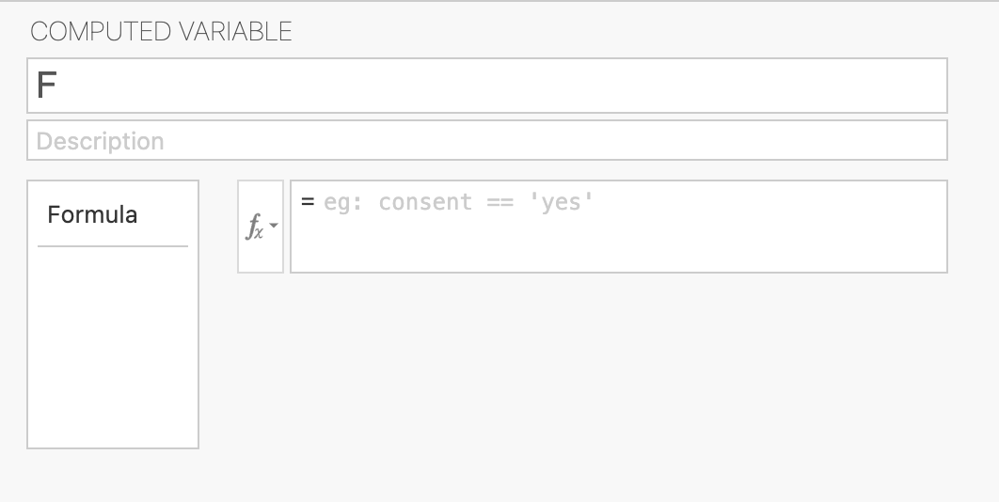

.. sectionauthor:: Laiton Hedley

========
Overview
========

    When analysing data, it is common for data to come in in a somewhat messy format. It's often necessary to "tidy" and transform our data so that it is in a form suitable for our analyses. This may involve computing sum scores for each partipant, excluding outliers, recoding responses, transforming response variables to different scales, aggregation (such as computing mean response time for each participant), etc.

    When raw data is first brought or entered into jamovi, it is represented in columns called *Data Variables*. This data can be analysed as-is, but it's also possible to alter, recode and transform this data using *Computed Variables* and *Transformed Variables*. The fourth and final sort of column is *Filters*, used for filtering data such as outliers.

==============
Data Variables
==============

    Data variables are simply the columns and rows of data brought or entered into jamovi. They typically represent the "raw data" that we want to use as a basis for our analyses. Opening a .csv file, or entering values directly into the spreadsheet will result in these values being represented in data variables.

Measure and Data Types
----------------------

    In jamovi, variables have a *Measure type* and a *Data type* to indicate the type of data contained in the variable and how it should be treated in analyses.

    Data types can be either:

      - Integer: whole numbers without decimal points
      - Decimal: numbers with decimal points
      - Text: text, words, or "strings" that make up words or categories.

    Note that jamovi does not support date and time data types at this time, however dates and times can be represented as text. Some basic date manipulations are described in Common Recipes *link* TODO.

    Measure types are used to indicate the `level of measurement <https://en.wikipedia.org/wiki/Level_of_measurement>`__.

      - |continuous_icon| Continuous: numbers where a continuum of values is meaningful, such as height, weight, counts.
      - |ordinal_icon| Ordinal: discrete values where order is meaningful, i.e. 'Strongly agree', 'Agree' ... '< 18', '18-30', ...
      - |nominal_icon| Nominal: discrete values with no meaningful order, i.e. Male, Female, ... 'Smoker', 'Non-smoker', ...
      - |id_icon| ID: unique identifiers for each row/participant.

    Note that the levels of measurement don't align perfectly with these types. jamovi follows a convention of combining *ratio* and *interval* into a single measure type *Continuous*. jamovi also provides an ID measure type for unique identifiers that are usually not analysed (i.e. Surname).

    When data is first brought in, jamovi automatically assigns data types and measure types based on the form the data takes. Most of the time this automatic assignment will be correct, but there may be scenarios where the data type or measure type need to manually adjusted.

    Note that some combinations of data type and measure type are not possible (e.g., a variable cannot be both text and continuous, or decimal and nominal).

    To change the data type and measure type of a variable, double click on the column header to open the variable editor.
    Here the variable's name, description, data type, and measure type can be seen and modified.
    Click on the measure type a drop down menu will appear with the options to change the measure type.
    To change the data type, click on the data type and select the desired data type from the drop down menu.
    For example, below is the variable editor for a variable called Score (representing some continuous percentage of performance) which incorrectly shows as Nominal data type with an Ordinal measure type:

      |data_var_editor|

    To change this to continuous, click on the measure type and select "Continuous" from the drop-down menu.
    Similarly, to change the data type to decimal, click on the data type and select "Decimal" from the drop-down menu.

      |data_var_editor_part_two|

    Now jamovi treats this variable as a continuous variable.
    This is important for performing analyses that require continuous data (such as a correlation or regression) or if we wish to perform mathematical operations on the variable (such as computing a z-score).

Missing Values
--------------

    Often data will contain missing values, jamovi provides a number of options to handle missing values.
    In jamovi, missing values are represented as blank cells in the data view.

    Some data sets use special values to encode missing values, for example, they may use the value -99 or 9999. This data, left as-is, will be treated by analyses as actual values. In order for these to be treated as missing values, it's necessary to instruct jamovi to treat these values as missing.

    With variable editor open, click on ``Missing values`` and a window will appear, click the ``Add Missing Value`` button.     Now, it is possible to specify when the source or rather the variable of interest has a value exactly, equal to, less than, or greater than a value, it should be treated as a missing value.

    For example, the formula of ``== 9999`` shown below means that any values equal to 9999 will be treated as missing values.

    |data_var_editor_missing_vals|

Adding Labels to Levels
------------------------
    For variables with a nominal or ordinal measure type, it is possible to add labels to the levels of the variable:
    Below is a table of data with a variable called "Group" which has a nominal measure type and integer data type.

      .. list-table:: Example of a Variable with Unlabeled Levels
        :header-rows: 1

        * - ID
          - Group
        * - 1
          - 1
        * - 2
          - 2
        * - 3
          - 1
        * - 4
          - 2

    The levels of 1 and 2 indicate whether the participant is a smoker or not, but these values are not very informative:
    Through the data variable editor levels 1 and 2 are presented for this variable:

      |data_var_recode_one|

    By clicking on the 1 and 2 in our variable editor, meaningful labels can be assigned to these levels - such as "Smoker" and "Non-smoker", respectively:

      |data_var_recode_two|

    Allowing us to have a more informative variable with the following data:

      .. list-table:: Example of a Variable with Labeled Levels
        :header-rows: 1

        * - ID
          - Group
        * - 1
          - Smoker
        * - 2
          - Non-smoker
        * - 3
          - Smoker
        * - 4
          - Non-smoker

    Now, when performing analyses, the labels "Smoker" and "Non-smoker" will be used instead of the values 1 and 2, making the results more informative and easier to interpret.

Reordering Levels
------------------------
    For Ordinal Data (and at times Nominal Data), we may wish to "reorder" the levels in which the data appear in Figures and Tables.

    Below is an example table of descriptive data computed via jamovi to begin inferring differences within a data set.

      .. list-table:: Example Descriptives Table with Levels Unordered
        :header-rows: 1

        * - Task Difficulty
          - Mean
          - Standard Deviation
        * - Low
          - 85.1
          - 9.5
        * - High
          - 54.3
          - 9.1
        * - Medium
          - 73.6
          - 9.3

    Each row represents one of three levels of Task Difficulty (Low, Medium, High) in a Memory Task, with columns to indicate the Mean and Standard deviation.
    However, the order in which the rows are presented is unintuitive, the High condition is in the middle and the natural order is interrupted.

    Jamovi can allow for the reordering of variables, so in all future Tables and Figures the levels appear in a more intuitive order; Low, Medium, then High.
    To do this, double click on variable of interest to open the variable editor.
    Here, the Levels (such as the Low, High, and Medium) for a Variable (like Task Difficulty) can be seen:

    |ts_table_reorder_me|

    Click on the level to reorder and use the arrow keys to move the level to an appropriate location in the heirarchy (the level at the top will be positoned at the left most or top position and bottom level will be position in the right most or lowest position for all future tables and figures):

    |ts_table_reordered|

    The descriptive table (and any following figures) will present the levels in the same order as indicated in the variable editor.
    For example, the table below now displays each level of Task Difficulty from Low to High in an intuitive fashion.

      .. list-table:: Example Descriptives Table with Levels Reordered
        :header-rows: 1

        * - Task Difficulty
          - Mean
          - Standard Deviation
        * - Low
          - 85.1
          - 9.5
        * - Medium
          - 73.6
          - 9.3
        * - High
          - 54.3
          - 9.1

    The natural order of the conditions is now preserved, moving down each row it appears a Low, Medium, then High, making the table easier to read and interpret.

  - TODO 'Retain unused levels in analyses'

.. _computed-variables:

==================
Computed Variables
==================

    Computed variables are used to transform values from the existing columns, creating new columns of data for analysis. For example, a computed column can transform responses to z-scores, or compute a total score from a number of survey items.

    Values are computed using simple formulas such as:

        Z(response)

        Q1 + Q2 + Q3 + Q4

    where ``response``, and ``Q1`` .. ``Q4`` refer to existing columns in the data set.

    The simplest way to add a new computed variable to a data set is to select the ``Add`` (variable) button from the ``Data`` tab. Selecting ``Append`` under ``Computed variables`` will add a new computed column to the very right of the data set. To configure the computed variable, select either ``Setup`` from the ``Data`` tab, or double click on the column header. This will the variable editor which looks as follows (for computed variables):

    |computed_screenshot|

    Here the new column can be named and given a description. Selecting the small fx button will bring down a list of the functions available and the list of variables (these can be inserted by double-clicking them). It's also possible to construct a formula by simply typing directly into the formula box.

    A number of functions are available. See :ref:`list-of-functions` for details.

    Computed variables are ideal for one-off computations, but where the same computation needs to be applied many times across many columns (For example, reverse scoring a number of responses), creating a computed variable for each column becomes tedious. In contrast, ``Transformed variables`` allow for the same transform to be applied across any number of columns. Further, transformed variables are ideal for "if-then" recoding of variables.

=====================
Transformed Variables
=====================

    ``Transformed variables`` are better suited for more complex transformations (such as reverse scoring and recoding variables) and allow the same transform to be applied across multiple columns of data.
    To add a new transformed variable to a data set, select the ``Add`` (variable) button from the ``Data`` tab.  Under ``Transformed Variable`` select ``Append``, this will add a new Transformed column to the very right of the data set. To configure the Transformed variable, select either ``Setup`` from the ``Data`` tab, or double click on the column header. By doing so, the following variable editor will appear:

    |Transformed_Variable|

    Here the new column can be given a name and a description - this can be helpful if you wish to use the same transformation multiple times. To perform the transformation, select the ``Source variable``, that is the column of data to transform.
    Additionally, select ``using transform``, which allows for either the selection of an existing transformation or the ability to create a new one by selecting ``Create New Transform...``.
    When creating a new transformation, a formula editor (like the computed variables option) will appear.
    The formula editor (via this option) requires the use of the ``$source`` variable to refer to the source variable selected earlier.

    For example, there is a survey item that needs to be reversed score. By using the ``New Transformed Variable`` option, the item can be reverse scored with the following formula:

      ``7 - $source``

    In this example, ``$source`` would be item_3 and we are assuming a 6-point Likert scale (hence the 7 minus):

    Applying this will yield results where 6 becomes 1, 5 becomes 2, 4 becomes 3, and so on:

    .. list-table:: Example of Reverse Scoring
       :header-rows: 1

       * - Item_1
         - Item_2
         - Item_3
         - 7 - $source
       * - 4
         - 3
         - 3
         - 4
       * - 3
         - 4
         - 6
         - 1
       * - 4
         - 4
         - 2
         - 5

    Once created, this transformation can be applied across any number of such variables (such as items_1, items_2, and so on) -- we will explore this shortly.

Recoding Variables
------------------

    *Transformed variables* are also ideal for recoding variables, i.e., recoding ``1-4`` and ``5-10`` cigarettes per day to ``Smoker`` and ``0`` cigarettes per day to ``Non-smoker``, or recoding values greater than or equal to 85 as a ``High Distinction``, greater than 75 as a ``Distinction``, etc.
    Recoding is performed by adding recode conditions with the ``Add recode condition`` button. Each recode condition is made up of a condition, i.e. ``$source == '1-4'``, or ``$source >= 85``, and a value to use if that condition is true, i.e. ``'Smoker'``, ``'High Distinction'``

    See the following example where grades are being assigned based on exam scores.:

    |Recode_Variable|

    Adding the additional conditions for the C and P grades would result in a transformed variable that would perform the following recoding.

    .. list-table:: Example of Recoding
       :header-rows: 1

       * - Exam Score
         - Grade
       * - 50
         - P
       * - 90
         - HD
       * - 44
         - F
       * - 76
         - D
       * - 66
         - C

    Note that when evaluating recode conditions, jamovi evaluates each condition one after another, and uses the value from the first condition that resolves to be true. In the above example, this allowed us to express the ``Distinction`` condition as ``$source >= 75``, rather than the longer ``$source < 85 and $source >= 75``. Values greater or equal to 85 will already been taken care of by the first condition.

Transforming Multiple Variables
-------------------------------

There are situations where multiple varibles need to be transformed. For example, there may be a number of items in a survey data set which need to be reverse scored.
Instead of recoding each item, one at a time, jamovi conveniently allows for the same transformation to be applied in a single step.

In this approach, select the variables to transform (either by holding down ctrl or ⌘ and clicking the colum headers, or selecting multiple variables under the ``Variables`` tab), and then select ``Transform`` from the ``Data`` tab. For each variable selected, a matching transformed variable will created, with the ``Source variable`` set accordingly. This allows you to define a single transform, and apply it across multiple variables at once.

.. * do we need an image for this? *

===================
Row and V Functions
===================

Functions in jamovi can be either *Row functions* or *Variable functions*.

Row Functions
-------------

*Row functions* only make use of other values in the same row. For example, the function ``MEAN(A, B, C)`` will result in a column of values where each cell's value is only computed from the values in its row.

.. list-table:: Example of the MEAN() Function
   :header-rows: 1

   * - A
     - B
     - C
     - MEAN(A, B, C)
   * - 1
     - 3
     - 4
     - 2.33
   * - 6
     - 3
     - 1
     - 3.33
   * - 5
     - 5
     - 9
     - 6.33

V Functions
-----------

*V functions* or *Variable functions* (typically prefixed with the letter ``V``), compute values using the entire variable. For example, ``VMEAN(A)`` computes the mean of the *entire* variable ``A``.

.. list-table:: Example of the VMEAN() Function
   :header-rows: 1

   * - A
     - B
     - C
     - VMEAN(A)
   * - 1
     - 3
     - 4
     - 4
   * - 6
     - 3
     - 1
     - 4
   * - 5
     - 5
     - 9
     - 4

It's possible to combine Row and V functions together. For example, to compute a z-score, use the function

  ``(A - VMEAN(A)) / VSTDEV(A)``

(but it's also possible to use the more concise ``Z(...)`` function!)

Grouping with V Functions
-------------------------

Several V functions allow a ``group_by`` parameter, allowing the calculation of values within groups.

Perhaps you have a dataset with a column labelled Dosage to indicate the treatment each participant recieved (e.g., 50 mg vs 100 mg vs 150 mg).
To compute the mean score of the outcome variable for each Dosage group separately (without the scores from one treatment being combined with those from another) call the ``group_by`` parameter, such as:

  ``VMEAN(outcome, group_by = Dosage)``

.. list-table:: Example of the VMEAN() Function with group_by argument
   :header-rows: 1

   * - Dosage
     - outcome
     - VMEAN(outcome, group_by = Dosage)
   * - 150 mg
     - 4
     - 4.33
   * - 150 mg
     - 4
     - 4.33
   * - 150 mg
     - 5
     - 4.33
   * - 100 mg
     - 3
     - 3
   * - 100 mg
     - 2
     - 3
   * - 100 mg
     - 4
     - 3
   * - 50 mg
     - 1
     - 1.33
   * - 50 mg
     - 2
     - 1.33
   * - 50 mg
     - 1
     - 1.33

.. _list-of-functions:

====================
⚡ List of Functions
====================

.. https://github.com/jamovi/jamovi/blob/4b490813d1442f93059e606a15ac39ef626c6d07/client/main/vareditor/formulatoolbar.ts#L89-L168

.. list-table:: Functions available in jamovi
   :header-rows: 1
   :widths: 12 55 10

   * - Function
     - Description
     -
   * -
     - **MATH FUNCTIONS**
     -
   * - ``ABS(var)``
     - Absolute value: Returns the absolute value in a column of data.
     - `More info <https://en.wikipedia.org/wiki/Absolute_value>`__
   * - ``EXP(var)``
     - Exponential: raises *e* to the power of each value in a column of data.
     - `More info <https://en.wikipedia.org/wiki/Exponential_function>`__
   * - ``LN(var)``
     - Natural logarithm (base *e*): the natural logarithm (base e) of each value in a column of data.
     - `More info <https://doi.org/10.1177/00045632211050531>`__
   * - ``LOG10(var)``
     - Log base 10: the logarithm (base 10) of each value in a column of data.
     - `More info <https://doi.org/10.1177/00045632211050531>`__
   * - ``SQRT(var)``
     - Square root: the square root of each value in a column of data.
     - `More info <https://en.wikipedia.org/wiki/Square_root>`__
   * -
     - **STATISTICAL FUNCTIONS**
     -
   * - ``ABSIQR(var)``
     - Absolute deviation from the median: measures the average absolute deviation of values from the median. Convenience short-hand for ``ABS(IQR(var))``.
     - `More info <https://en.wikipedia.org/wiki/Interquartile_range>`__
   * - ``ABSZ(var)``
     - Absolute z-score: Convenience short-hand for ``ABS(Z(var))``
     -  `More info <https://en.wikipedia.org/wiki/Standard_score>`__
   * - ``BOXCOX(var)``
     - Box Cox: Returns a Box Cox transformation of the variable.
     - `More info <https://en.wikipedia.org/wiki/Power_transform#Box%E2%80%93Cox_transformation>`__
   * - ``CEILING(var)``
     - Ceiling: returns the smallest integer that is greater than or equal to each value in a column of numbers, effectively rounding up to the nearest whole number.
     - `More info <https://en.wikipedia.org/wiki/Floor_and_ceiling_functions>`__
   * - ``FLOOR(var)``
     - Floor: returns the greatest integer that is less than each value in a column of numbers, effectively rounding down to the nearest whole number.
     - `More info <https://en.wikipedia.org/wiki/Floor_and_ceiling_functions>`__
   * - ``IQR(var)``
     - Interquartile Range: Returns values of 0 to indicate a number is within the box of a boxplot and values larger than 1.5 to indicate the number is outside the whiskers.
     - `More info <https://en.wikipedia.org/wiki/Interquartile_range>`__
   * - | ``MAX(var)``
       | ``MAX(var_1, var_2, ...)``
       | ``VMAX(var)``
       | ``VMAX(var, group_by = other_var)``
     - Maximum: identifies the highest value in a row or column of data.
     - `More info <https://en.wikipedia.org/wiki/Maximum_and_minimum>`__
   * - ``MAXABSIQR(var)``
     - Maximum Absolute Interquartile Range: Convenience short-hand for ``MAX(ABSIQR( variable 1, variable 2, … ))``.
     - `More info <https://en.wikipedia.org/wiki/Interquartile_range>`__
   * - ``MAXABSZ(var)``
     - Maximum Absolute Z-Score: Convenience short-hand for ``MAX(ABSZ( variable 1, variable 2, … ))``.
     - `More info <https://en.wikipedia.org/wiki/Standard_score>`__
   * - | ``MEAN(var)``
       | ``MEAN(var_1, var_2, ...)``
       | ``VMEAN(var)``
       | ``VMEAN(var, group_by = other_var)``
     - Mean: Calculate the mean score across a row or column of data.
     - `More info <https://en.wikipedia.org/wiki/Mean>`__
   * - | ``MIN(var)``
       | ``MIN(var_1, var_2, ...)``
       | ``VMIN(var)``
       | ``VMIN(var, group_by = other_var)``
     - Minimum: identifies the lowest value in a row or column of data.
     - `More info <https://en.wikipedia.org/wiki/Maximum_and_minimum>`__
   * - ``RANK(var)``
     - Ranking: assigns an ordinal rank to each value in a column of data.
     - `More info <https://en.wikipedia.org/wiki/Ranking_(statistics)>`__
   * - ``ROUND(var, n)``
     - Rounding: adjusts each value in a column of data to a specified number of decimal places or to the nearest whole number.
     - `More info <https://en.wikipedia.org/wiki/Rounding>`__
   * - ``SCALE(var)``
     - Scale: Returns the normalized values of a set of numbers - synonym for ``Z(var)``.
     - `More info <https://en.wikipedia.org/wiki/Standard_score>`__
   * - | ``STDEV(var)``
       | ``STDEV(var_1, var_2, ...)``
       | ``VSTDEV(var)``
       | ``VSTDEV(var, group_by = other_var)``
     - Standard deviation: measures the amount of standard deviation in a row or column of data.
     - `More info <https://en.wikipedia.org/wiki/Standard_deviation>`__
   * - | ``SUM(var)``
       | ``SUM(var_1, var_2, ...)``
       | ``VSUM(var)``
       | ``VSUM(var, group_by = other_var)``
     - Summation: Returns the sum of a row or column of data.
     - `More info <https://en.wikipedia.org/wiki/Summation>`__
   * - | ``VMAD(var)``
       | ``VMAD(var, group_by = other_var)``
     - Median Absolute Deviation: Returns the median absolute deviation of a variable.
     - `More info <https://en.wikipedia.org/wiki/Median_absolute_deviation>`__
   * - | ``VMADR(var)``
       | ``VMADR(var, group_by = other_var)``
     - Robust Median Absolute Deviation: Returns the robust median absolute deviation of a variable.
     - `More info <https://en.wikipedia.org/wiki/Median_absolute_deviation>`__
   * - | ``VMED(var)``
       | ``VMED(var, group_by = other_var)``
     - Median: Returns the median of a variable.
     - `More info <https://en.wikipedia.org/wiki/Median>`__
   * - | ``VMODE(var)``
       | ``VMODE(var, group_by = other_var)``
     - Mode: Returns the most common value, or mode, in a variable.
     - `More info <https://en.wikipedia.org/wiki/Mode_(statistics)>`__
   * - | ``VN(var)``
       | ``VN(var, group_by = other_var)``
     - Sample Size (or n): Returns the number of cases in a variable.
     - `More info <https://en.wikipedia.org/wiki/Sample_size_determination>`__
   * - | ``VSE(var)``
       | ``VSE(var, group_by = other_var)``
     - Standard Error: Returns the standard error of a variable.
     - `More info <https://en.wikipedia.org/wiki/Standard_error>`__
   * - | ``VAR(var)``
       | ``VVAR(var)``
       | ``VVAR(var, group_by = other_var)``
     - Variance: Returns the variance of a row or column of data.
     - `More info <https://en.wikipedia.org/wiki/Variance>`__
   * - ``Z(var)``
     - Z-score: Returns the normalized values of a set of numbers.
     - `More info <https://en.wikipedia.org/wiki/Standard_score>`__
   * -
     - **LOGICAL FUNCTIONS**
     -
   * - ``IF(var, value, else)``
     - If the expression resolves true, use the value, otherwise the else.
     - `More info <https://en.wikipedia.org/wiki/Conditional_(computer_programming)>`__
   * - ``IFMISSING(var, value, else)``
     - When the variable contains a missing value, use the value, otherwise the else.
     - `More info <https://en.wikipedia.org/wiki/Conditional_(computer_programming)>`__
   * - ``NOT(var)``
     - Inverts a boolean value: true (1) becomes false (0), false (0) becomes true (1).
     - `More info <https://en.wikipedia.org/wiki/Negation>`__
   * -
     - **TEXT FUNCTIONS**
     -
   * - ``CONTAINS('needle', haystack)``
     -  Determines if specificied string of text (i.e. 'needle') appears in the variable (i.e. haystack) and can be expanded to look for multiple strings across one or more variables: ``CONTAINS('text_1', 'text_2', var_1, var_2)``.
     - `More info <https://en.wikipedia.org/wiki/String_searching_algorithm>`__
   * - ``SPLIT(var, 'by', position)``
     - Splits a string of text in a variable by a specified character (or string of text) and returns only the text at the specified position. For example, the string `ParticipantbyP01` using ``SPLIT(var, 'by', 3)`` would return `P01`.
     -  `More info <https://en.wikipedia.org/wiki/String_(computer_science)>`__
   * - ``TEXT(var)``
     - Converts values to text format (numbers to strings of text).
     -  `More info <https://en.wikipedia.org/wiki/String_(computer_science)>`__
   * - ``VALUE(var)``
     - Converts text (strings) to values (if possible).
     - `More info <https://en.wikipedia.org/wiki/String_(computer_science)>`__
   * -
     - **DATE/TIME FUNCTIONS**
     -
   * - ``DATEVALUE(var)``
     - Takes a date in text format (i.e. 2000-12-20) and converts to the number of days since the 1st of January, 1970.
     -
   * - ``DATE(var)``
     - Takes a number representing the number of days since the 1st of January 1970, and produces a formatted date.
     -
   * -
     - **REFERENCE FUNCTIONS**
     -
   * - ``HLOOKUP(index, value_1, value_2, ...)``
     - Why would anyone use this? WTF DOES THIS EVEN MEAN: The value in the provided values at index.
     -
   * - ``MATCH(value, value_1, value_2, ...)``
     - Why would anyone use this? WTF DOES THIS EVEN MEAN: The index of value in the provided values.
     -
   * -
     - **MISC. FUNCTIONS**
     -
   * - ``COUNT(var)``
     - Counts the number of non-missing values.
     - `More info <https://en.wikipedia.org/wiki/Counting>`__
   * - ``FILTER(var, filter expression)``
     - Filters a variable using a filter expression. For example, ``FILTER(var_1, var_2 == "Group_A")`` returns only rows in var_1 where var_2 is matched with the label "Group A".
     - `More info <https://blog.jamovi.org/2018/04/25/jamovi-filters.html>`__
   * - ``INT(var)``
     - Converts a number to an integer.
     - `More info <https://en.wikipedia.org/wiki/Integer>`__
   * - ``OFFSET(var, n)``
     - Offsets a column of data up or down by +/- n rows
     - `More info <https://en.wikipedia.org/wiki/Offset_(computer_science)>`__
   * - ``ROW()``
     - Returns a column with each row indicating the row number.
     - `More info <https://en.wikipedia.org/wiki/Row_and_column>`__
   * - ``SAMPLE(var, n)``
     - Draws a random sample of n values from a variable.
     - `More info <https://en.wikipedia.org/wiki/Sampling_(statistics)>`__
   * - ``VROWS(var)``
     - Returns the number of rows of a variable.
     - `More info <https://en.wikipedia.org/wiki/Row_and_column>`__
   * -
     - **SIMULATION FUNCTIONS**
     -
   * - ``BETA()``
     - Draws samples from a Beta distribution.
     - `More info <https://en.wikipedia.org/wiki/Beta_distribution>`__
   * - ``GAMMA()``
     - Draws samples from a Gamma distribution.
     - `More info <https://en.wikipedia.org/wiki/Gamma_distribution>`__
   * - ``NORM()``
     - Draws samples from a Normal (Gaussian) distribution.
     - `More info <https://en.wikipedia.org/wiki/Normal_distribution>`__
   * - ``UNIF()``
     - Draws samples from a Uniform distribution.
     - `More info <https://en.wikipedia.org/wiki/Uniform_distribution_(continuous)>`__

Understanding Formulas
----------------------
  In jamovi formulas are constructed using a combination of numbers, variables, values, operators and functions.

  Numbers are simply numbers (i.e. 1, 2.5, -3), adding two numbers together performs arithmetic (i.e. 2 + 2 = 4).
  Variables are referred to by their name (i.e. variable_name) and can be referred to with backticks as well (i.e. \`variable name\`) - when the variable name contains spaces it is a requirement to use backticks otherwise jamovi will not be able to interpret the formula correctly.

  Often we use strings of text in our rows of data to indicate categories or conditions.
  In jamovi, adding two text values together performs concatenation or rather joins them together (i.e. hello + world = helloworld)
  Adding numbers and strings of text together, again performs concatenation where by the number is converted to text alogside the string of text (i.e. 2 + apples = 2apples).

  When using formulas often we may wish to use ``and`` and ``or``  when performing are logical operations (i.e. ``IF(var_1 > 5 and var_2 < 10, 'Yes', 'No')`` and ``IF(var_1 == 'A' or var_2 == 'B', 'Match', 'No Match')``)

  values surrounded by ticks are strings of text (i.e. \'10\')

==============
Filtering Data
==============
  Often only a subset of data is needed for an analysis. For example, perhaps only participants who smoke are needed in an analysis.
  By clicking the data tab and selecting the filter icon, a filter is created and restricts any analyses to only those rows that meet the filter's criteria.

  |Filter_Data|

  The filer used above, ``Smoke == 'Yes'``, has filtered out any participants who do not smoke or rather restricted the data set to only participants who smoke.
  Below is an example of how this filter has effected the data, the first column shows the rows that are included (with a tick) and which are excluded (with a cross):

    .. list-table:: Example of Filtering Data
      :header-rows: 1

      * - Filter
        - Smoke
        - Outcome
      * - ✔
        - Yes
        - 10
      * - ✘
        - No
        - 4
      * - ✘
        - No
        - 6
      * - ✔
        - Yes
        - 9
      * - ✔
        - Yes
        - 9

  Only the data that has a tick (or rather participants who smoke) will be included in analyses and visualisations.
  It is possible to filter out based on multiple variables by using the ``and`` and ``or`` operators.
  For example, to filter based on Female Sex and Age of 30 and greater the following filter could be used: ``Sex == 'Female' and Age >= 30``.
  The same principles can be applied for ``or`` conditions as well and if wishing to filter on the same variable multiple times.

  Alternatively, an additional filter can be created by clicking the plus icon in the filter editor.
  A second filter will appear below the first, and by adding the desired filter criteria such as ``Age >= 30``, the data will be filtered based on both filters.
  Additionally, we can toggle each filter on and off by clicking the toggle and switching it to active or inactive:

  |Toggle_Filter_Data|

  .. More information about filters can be found in our blog post `here <https://blog.jamovi.org/2018/04/25/jamovi-filters.html>`_.

.. I think VFUNCTIONS work the way I would expect them to with filters... but maybe we chat...
.. . and why you can't use *V functions* in filters (sad face) (we'll need to link to this explanation)

==================
Restructuring Data
==================

What is Wide vs Long Format?
-----------------------------
  Within data analysis, two common data structures are often required these are *wide format* and *long format* .
  Wide format data is set up such that each row represents a participant, and repeated measurements are stored in separate columns (one column per outcome at each time point or condition).
  For example, below we have the quiz score of students during Weeks 2, 4, and 6 of Semester displayed in wide format:

    .. list-table:: Wide Format Example
      :header-rows: 1

      * - ID
        - ScoreWeek_2
        - ScoreWeek_4
        - ScoreWeek_6
      * - 1
        - 30
        - 50
        - 70
      * - 2
        - 20
        - 30
        - 55
      * - 3
        - 40
        - 50
        - 52

  Here each row represents a unique student (ID), and their quiz scores at Weeks 2, 4, and 6 are stored in separate columns.
  To run a repeated measures ANOVA, or rather to compare the average quiz scores across the three weeks, jamovi (much like other statistical software) requires the data to be in wide format as shown above.

  In long-format, each row represents a single measurement occasion for a participant with multiple rows per participant.
  Below is the same data of the quiz scores at Weeks 2, 4, and 6 represented in long format:

    .. list-table:: Long Format Example
      :header-rows: 1

      * - ID
        - Time
        - Score
      * - 1
        - Week_2
        - 30
      * - 1
        - Week_4
        - 50
      * - 1
        - Week_6
        - 70
      * - 2
        - Week_2
        - 20
      * - 2
        - Week_4
        - 30
      * - 2
        - Week_6
        - 55
      * - 3
        - Week_2
        - 40
      * - 3
        - Week_4
        - 50
      * - 3
        - Week_6
        - 52

  As shown above, Score is now a single column with all Score values stacked, and Time is a separate variable that indicates the Week of measurement (e.g., Week_2, Week_4, Week_6).
  Using long format makes it easy to summarise, plot, and model change over time because time is represented explicitly as data rather than being embedded in column names.
  Long format is also required for mixed modelling, by having the data in long format, we can easily specify both fixed effects (e.g., the effect of time on quiz scores) and random effects (e.g., individual differences between students).

  When working with data, it is often necessary to restructure the data from a wide format to a long format or vice versa. Below is a guide on how to restructure data in jamovi.

Restructuring with jReshape
---------------------------

  To restructure data in jamovi (at this time) requires the jReshape module, which can be installed by clicking the plus icon in the top right of jamovi and searching for the module name ``jReshape``.
  Once installed and loaded, the jReshape module allows for the functionality to restructure data from wide to long format and vice versa.
  Under the ``Analyses`` tab, a new option called ``Data`` will appear which contains the jReshape options.

Wide to Long
~~~~~~~~~~~~

  To transform data from wide format to long format, click on ``Analyses`` tab, select ``Data``, and then from the dropdown select ``Wide to Long``.
  Here, take the columns that represent the repeated measurements (i.e., Score_Week_2, Score_Week_4, Score_Week_6) and move them into the ``Columns to row`` box.
  Below we have the option rename our new columns, under ``Target Variable`` rename this variable sensibly such as the name of the dependant variable (i.e., ``Score``).
  Additonaly, under ``Index Variable (conatins repeated levels values)`` this should be named something that indicates the condition or time point (i.e., ``Time``).
  In the output window, check the data preview (this shows what the data will look like once transformed).
  If the preview is correct and sensible, click the blue ``Create`` button and jamovi will open a new jamovi window with the data set now transformed to long format.

Long to Wide
~~~~~~~~~~~~

  To transform data from long format to wide format in jamovi, click on ``Analyses`` tab, select ``Data``, and then from the dropdown select ``Long to Wide``.
  Here, move the variable that contains the variable of interest (i.e., ``Score``) into the ``Rows to Columns`` box.
  Next, choose the variable that identifies the repeated measurements time point or condition (i.e., ``Time``) and move this into the ``Indexing Variables`` box.
  To ensure the data is restructured correctly, we need to also move the variable that identifies the unique participant (i.e., ``ID``) into the ``ID Variable`` box.
  In the right hand side output window, double-check the data preview (this shows what the data will look like once transformed).
  If the preview is correct and sensible, click the blue ``Create`` button and jamovi will open a new jamovi window with the data set now transformed to wide format.

===================
Common Data Recipes
===================

TODO

  - Excluding outliers
  - Reverse scoring survey items
  - Computing a sum score (say an extraversion questionaire)
  - Recoding a continuous variable to categories
  - Recoding/reducing the number of categories
  - Split by functionality (jamovi does this poorly)
  - Analysing a subset of data
  - String concatenation

Date Handling
-------------

Date handling in jamovi is currently fairly limited. There is no 'native' Date data type at this time (one is planned however). The following describes a number of date manipulations that are available.

There are two useful date functions, ``DATEVALUE()`` and ``DATE()``, that can be used with :ref:`computed-variables`. ``DATEVALUE()`` converts a date string such as ``2025-01-29`` to an integer representing the number of days since January 1st, 1970. ``DATE()`` performs the opposite transformation, converting such an integer into a date string. A useful way to use these functions is to first convert the date to an integer, perform some computation, and then convert the result back to a date string. Both functions optionally take a date format string if using a particular format.

    .. list-table:: Example date formatting
      :header-rows: 1

      * - Day
        - ``DATE(Day)``
        - ``DATE(Day, "%d %m %Y")``
        - ``DATE(Day, "%m/%d/%y")``
      * - 13
        - 1970-01-13
        - 13 01 1970
        - 01/13/81
      * - 4197
        - 1981-06-29
        - 29 06 1981
        - 06/29/81

Computing a date in the future
~~~~~~~~~~~~~~~~~~~~~~~~~~~~~~

The following example converts a date to an integer, adds 7 (representing 7 days), and then converts it back to a date string.

    .. list-table:: Adding 7 days to a date
      :header-rows: 1

      * - Date
        - ``DATEVALUE(Date)``
        - ``DATEVALUE(Date) + 7``
        - ``DATE(DATEVALUE(Date) + 7)``
      * - 2026-01-29
        - 20482
        - 20489
        - 2026-02-05
      * - 2024-03-10
        - 19792
        - 19799
        - 2024-03-17
      * - 2025-08-22
        - 20322
        - 20329
        - 2025-08-29

Computing days elapsed
~~~~~~~~~~~~~~~~~~~~~~

    .. list-table:: Computing days elapsed
      :header-rows: 1

      * - StartDate
        - EndDate
        - ``DATEVALUE(EndDate) - DATEVALUE(StartDate)``
      * - 2026-01-29
        - 2026-02-15
        - 17
      * - 2024-03-10
        - 2024-04-11
        - 32
      * - 2025-08-22
        - 2024-04-11
        - -498

Extracting month, year, or day
~~~~~~~~~~~~~~~~~~~~~~~~~~~~~~

The ``SPLIT()`` function can be used to extract the year, month, or day of month, from a date string. The ``SPLIT()`` function takes a text value (such as a date string), splits it into chunks using the second argument as the delimeter, and returns the nth chunk, determined by the third argument. Note that ``SPLIT()`` returns a text value, which will needs to be converted to an integer (with the ``INT()`` function) if to be used in arithmetic.

    .. list-table:: Extracting month, year, or day
      :header-rows: 1

      * - Date
        - ``SPLIT(Date, '-', 1)``
        - ``SPLIT(Date, '-', 2)``
        - ``SPLIT(Date, '-', 3)``
      * - 2026-01-29
        - 2026
        - 01
        - 29
      * - 2024-03-10
        - 2024
        - 03
        - 10
      * - 2025-08-22
        - 2025
        - 08
        - 22

Composing a date from parts
~~~~~~~~~~~~~~~~~~~~~~~~~~~

    .. list-table:: Composing a date from parts
      :header-rows: 1

      * - Year
        - Month
        - DayOfMonth
        - ``Year + '-' + Month + '-' + DayOfMonth``
      * - 2026
        - 01
        - 29
        - 2026-01-29
      * - 2024
        - 03
        - 10
        - 2024-03-10
      * - 2025
        - 08
        - 22
        - 2025-08-22

.. toctree::
   :maxdepth: 1

.. ----------------------------------------------------------------------------

.. |Reverse_Score| image:: /_images/tr_reverse_score_likert.png
  :alt: How to reverse score a likert item using the transformed variable option.
  :class: centered
  :width: 37%

.. |Transformed_Variable| image:: /_images/tr_transformed_variable.png
  :alt: Example transformation variable editor using the transformed variable option.
  :class: centered
  :width: 37%

.. |Recode_Variable| image:: /_images/tr_transform_recode.png
  :alt: How to recode a variable using the transformed variable option.
  :class: centered
  :width: 37%

.. |Filter_Data| image:: /_images/tr_filter_example.png
  :alt: How to filter data in jamovi.
  :class: centered
  :width: 37%

.. |Toggle_Filter_Data| image:: /_images/tr_toggle_filter.png
  :alt: How to toggle filter on and off in jamovi.
  :class: centered
  :width: 37%

.. |data_var_editor| image:: /_images/ts_var_types_part_one.png
  :alt: The data editor in jamovi where you can edit your data and create new variables.
  :class: centered
  :width: 42%

.. |data_var_editor_part_two| image:: /_images/ts_var_types_part_two.png
  :alt: The data editor in jamovi where you can edit your data and create new variables.
  :class: centered
  :width: 42%

.. |data_var_editor_missing_vals| image:: /_images/ts_missing_val.png
  :alt: The data editor in jamovi where you can edit your data and specify missing values.
  :class: centered
  :width: 42%

.. |data_var_recode_one| image:: /_images/ts_recode_one.png
  :alt: The data editor in jamovi where you can recode your variables using the recode option.
  :class: centered
  :width: 42%

.. |data_var_recode_two| image:: /_images/ts_recode_two.png
  :alt: The data editor in jamovi where you can recode your variables using the recode option.
  :class: centered
  :width: 42%

.. |continuous_icon| image:: /_images/variable-continuous.svg
  :alt: Integer type icon
  :height: 18px

.. |nominal_icon| image:: /_images/variable-nominal.svg
  :alt: Integer type icon
  :height: 18px

.. |ordinal_icon| image:: /_images/variable-ordinal.svg
  :alt: Integer type icon
  :height: 18px

.. |id_icon| image:: /_images/variable-id.svg
  :alt: Integer type icon
  :height: 18px

.. |ts_table_reordered| image:: /_images/ts_reordered_table.png
  :alt: The data editor in jamovi where you can reorder the levels in your variable to be more intuitive: Low, Medium, High.
  :class: centered
  :width: 42%

.. |ts_table_reorder_me| image:: /_images/ts_unordered_table.png
  :alt: The data editor in jamovi where you can reorder the levels in your variable to be more intuitive - currently they appear in an unusual order: Low, High, Medium.
  :class: centered
  :width: 42%
